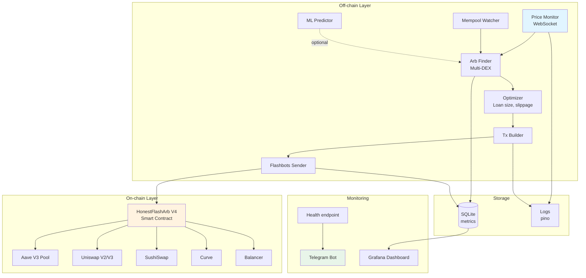

# 🚀 Промт для улучшения арбитражного бота и контракта

## 📌 Контекст проекта

У меня есть проект флэш-лоан арбитражного бота, состоящий из двух частей:

### 1. Smart-контракт `HonestFlashArbV2` (Solidity 0.8.21)

Текущая функциональность:
- Берёт flash loan через Aave V3 (`flashLoanSimple`)
- Выполняет двухногую арбитражную сделку через V2-роутеры (Uniswap V2 / SushiSwap)
- Использует whitelist роутеров и токенов
- Проверяет минимальную прибыль (`minProfit`)
- Имеет автовывод прибыли при достижении порога (`autoWithdrawThreshold` per token)
- Поддерживает паузу, `sweepToken` для аварийного вывода
- Использует кастомные ошибки и события

Структура `ArbPlan`:
```solidity
struct ArbPlan {
    address router1;
    address router2;
    address[] path1;
    address[] path2;
    uint256 amountOutMin1;
    uint256 amountOutMin2;
    uint256 minProfit;
    uint256 deadline;
}
```

### 2. Off-chain бот (Node.js + ethers v5 + Flashbots)

Текущая функциональность:
- Polling-режим (опрос `getAmountsOut` каждые 3 сек)
- Проверка 2-3 пар (USDC↔WETH, USDC↔DAI)
- Использует только Uniswap V2 и SushiSwap
- Отправляет транзакции через Flashbots Bundle Provider
- Симулирует перед отправкой
- Простая логика slippage (фиксированный bps)
- Минимальное логирование (`console.log`)

Модули:
- `config.js` — конфигурация
- `priceMonitor.js` — получение цен с DEX
- `arbFinder.js` — поиск арбитражных возможностей
- `txBuilder.js` — сборка транзакций
- `flashbotsSender.js` — отправка во Flashbots
- `index.js` — главный цикл

---

## 🎯 Что нужно реализовать

Доработать **и контракт, и бота** до уровня, близкого к продакшен-готовому MEV-боту для одиночки. Реализовать улучшения **поэтапно** (по уровням сложности).

---

## 📦 УРОВЕНЬ 1: Базовые улучшения (приоритет HIGH)

### 1.1. Контракт: добавить builder tip для Flashbots

**Цель**: возможность платить tip напрямую валидатору из контракта, чтобы выигрывать аукционы Flashbots.

**Требования**:
- Новый параметр в `ArbPlan`: `uint256 builderTipWei`
- После успешного арбитража, ПЕРЕД выводом прибыли, отправлять tip в `block.coinbase`
- Tip берётся в ETH; если контракт не имеет ETH — конвертировать часть прибыли через swap (если asset == WETH, просто unwrap; иначе swap → WETH → unwrap)
- Tip не должен превышать `profit / 2` (защита от ошибок)
- Добавить событие `BuilderTipPaid(address indexed builder, uint256 amount)`
- Добавить переменную `address public weth` (передаётся в конструкторе) для конвертации

**Edge cases**:
- Если tip > profit → revert с ошибкой `TipTooHigh`
- Если конвертация в ETH провалилась → revert
- Если `block.coinbase == address(0)` (PoS-кейсы) → пропустить tip

### 1.2. Контракт: multicall для пакетной отправки арбитражей

**Цель**: одной транзакцией можно отправить N арбитражных операций последовательно.

**Требования**:
- Новая функция `multiStartArbitrage(address[] assets, uint256[] amounts, ArbPlan[] plans)`
- Если одна из операций reverts → вся транзакция откатывается
- Опционально: флаг `bool allowPartialSuccess` для режима "выполнять что получится"
- Логировать каждую операцию отдельным событием

### 1.3. Контракт: транзитивная передача владения (Ownable2Step)

**Цель**: безопасная смена владельца через двухэтапный процесс.

**Требования**:
- Убрать `immutable` с `owner`
- Добавить `address public pendingOwner`
- Функция `transferOwnership(address newOwner)` — только текущий owner
- Функция `acceptOwnership()` — только pendingOwner
- События `OwnershipTransferStarted` и `OwnershipTransferred`

### 1.4. Контракт: динамические whitelist'ы

**Цель**: возможность добавлять/удалять роутеры и токены после деплоя.

**Требования**:
- `addRouter(address)` / `removeRouter(address)` — только owner
- `addToken(address)` / `removeToken(address)` — только owner
- Batch-версии: `addRouters(address[])`, `addTokens(address[])`
- События `RouterAdded`, `RouterRemoved`, `TokenAdded`, `TokenRemoved`

### 1.5. Бот: WebSocket вместо polling

**Цель**: реакция на новые блоки в реальном времени.

**Требования**:
- Заменить `JsonRpcProvider` на `WebSocketProvider`
- Подписка на событие `'block'` вместо `while(true) + sleep`
- Auto-reconnect при разрыве соединения
- Health check соединения каждые 30 сек (ping/pong)
- Параметр `wsUrl` в `.env`

### 1.6. Бот: Multicall3 для получения цен

**Цель**: одним RPC-вызовом получать цены всех пар на всех DEX.

**Требования**:
- Использовать Multicall3 (`0xcA11bde05977b3631167028862bE2a173976CA11`)
- Модуль `multicallPriceMonitor.js`
- Метод `getAllPrices(pairs)` возвращает Map<pairName, {uniOut, sushiOut, ...}>
- Поддержка разных типов вызовов в одном multicall

### 1.7. Бот: структурированное логирование с pino

**Цель**: production-ready логи в JSON для анализа.

**Требования**:
- Заменить все `console.log` на `pino`
- Уровни: `info`, `warn`, `error`, `debug`
- Контекстные поля: `pair`, `direction`, `profit`, `gasUsed`, `blockNumber`
- Ротация логов (pino-roll)
- Опциональный вывод в Telegram через `pino-telegram`

### 1.8. Бот: dry-run режим

**Цель**: тестирование без реальной отправки транзакций.

**Требования**:
- Флаг `DRY_RUN=true` в `.env`
- В dry-run: симулировать, логировать результаты, но НЕ вызывать `sendBundle`
- Собирать статистику: сколько возможностей найдено, какая ожидаемая прибыль

---

## 🔥 УРОВЕНЬ 2: Серьёзные доработки (приоритет MEDIUM)

### 2.1. Контракт: поддержка Uniswap V3

**Цель**: работать с Uniswap V3 (больше ликвидности, больше арбитражных возможностей).

**Требования**:
- Новая структура `ArbPlanV3` или флаг `bool isV3` в `ArbPlan`
- Поддержка `ISwapRouter02.exactInput(bytes path, ...)` для V3
- Path для V3: encoded bytes (tokenA + fee + tokenB + fee + tokenC)
- Whitelist V3-роутеров отдельно
- Возможность смешивать V2 + V3 в одном арбитраже (V2 на одной ноге, V3 на другой)
- Учитывать fee tiers V3 (500, 3000, 10000)

### 2.2. Контракт: защита от reentrancy

**Цель**: дополнительная защита (хотя текущая логика уже устойчива через `loanOpen`).

**Требования**:
- Добавить `nonReentrant` modifier (или использовать OpenZeppelin)
- Применить к `startArbitrage`, `sweepToken`, `withdrawAccumulatedProfit`

### 2.3. Контракт: события для мониторинга

**Цель**: подробное логирование для off-chain аналитики.

**Требования**:
- `SwapExecuted(uint8 leg, address router, uint256 amountIn, uint256 amountOut)`
- `ArbitrageFailed(address asset, uint256 amount, string reason)` (через try/catch)
- `GasUsage(uint256 startGas, uint256 endGas)` для оптимизации

### 2.4. Бот: pending mempool watcher

**Цель**: ловить большие свопы в mempool и делать back-run арбитраж.

**Требования**:
- Подписка на `provider.on('pending', ...)`
- Фильтр: только транзакции к whitelisted роутерам
- Декодирование `swapExactTokensForTokens` calldata
- Если своп > $50k → проверить возможность back-run арбитража после него
- Симуляция в bundle с pending tx + наш арбитраж

### 2.5. Бот: оптимальный размер займа

**Цель**: вместо фиксированной суммы займа — вычислять оптимальный размер для максимизации прибыли.

**Требования**:
- Бинарный поиск оптимального `loanAmount` (учитывая slippage пулов)
- Учитывать ликвидность пулов (`getReserves` для V2)
- Не превышать N% от меньшего пула (чтобы не двинуть цену слишком сильно)
- Кэшировать reserves на 1 блок

### 2.6. Бот: динамический slippage

**Цель**: адаптировать slippage tolerance под волатильность пары.

**Требования**:
- Хранить историю цен (последние 100 блоков)
- Считать стандартное отклонение
- Slippage = base + k * volatility (где base=20bps, k подбирается)
- Минимум 20bps, максимум 200bps
- Per-pair настройка

### 2.7. Бот: multi-block targeting

**Цель**: отправлять bundle на 2-3 будущих блока одновременно.

**Требования**:
- В `flashbotsSender.sendBundle` принимать массив targetBlocks
- Использовать `Promise.all` для параллельной отправки
- Отслеживать результаты по всем блокам
- Не повторять nonce (один nonce на bundle, но разные блоки)

### 2.8. Бот: SQLite для метрик

**Цель**: хранить историю работы для анализа.

**Требования**:
- Использовать `better-sqlite3`
- Таблицы:
  - `opportunities` (timestamp, pair, direction, expected_profit, real_profit, status)
  - `simulations` (bundle_hash, target_block, gas_used, coinbase_diff)
  - `inclusions` (bundle_hash, block_number, tx_hash)
  - `prices` (timestamp, pair, dex, amount_in, amount_out)
- Экспорт в CSV для анализа в Excel/Python

### 2.9. Бот: Telegram-уведомления

**Цель**: алерты о важных событиях.

**Требования**:
- Использовать `node-telegram-bot-api`
- Уведомления о:
  - Успешном арбитраже (с суммой прибыли)
  - Критических ошибках (контракт на паузе, низкий баланс ETH)
  - Ежедневный отчёт (через cron)
- Команды бота: `/status`, `/pause`, `/unpause`, `/stats`

---

## 💎 УРОВЕНЬ 3: Профессиональный уровень (приоритет LOW)

### 3.1. Контракт: поддержка Curve и Balancer

**Цель**: расширить набор DEX для арбитража стейблкоинов и мульти-токеновых пулов.

**Требования**:
- Универсальный интерфейс свопа (адаптеры под каждый DEX)
- `ICurvePool.exchange(int128 i, int128 j, uint256 dx, uint256 min_dy)`
- `IBalancerVault.swap(SingleSwap, FundManagement, limit, deadline)`
- Whitelist пулов Curve/Balancer отдельно

### 3.2. Контракт: gas optimization

**Цель**: снизить стоимость газа на каждую операцию.

**Требования**:
- Упаковка переменных в один storage slot
- Использовать `unchecked` блоки где безопасно
- Заменить mappings на immutable массивы где возможно
- Inline assembly для критических участков
- Бенчмарк: сравнить gas before/after через Hardhat

### 3.3. Бот: cross-chain поддержка

**Цель**: работать одновременно в нескольких сетях.

**Требования**:
- Архитектура chain-agnostic: класс `ChainBot` для каждой сети
- Поддержка: Ethereum mainnet, Arbitrum, Polygon, Base, Optimism
- Per-chain конфиг: RPC, контракт, роутеры, токены, MEV-relay
- Учитывать разные MEV-инфраструктуры:
  - Mainnet: Flashbots, MEV-Share
  - Arbitrum: нет приватного mempool, прямая отправка
  - Polygon: Fastlane
- Общий dashboard с метриками по всем сетям

### 3.4. Бот: оптимизация пути (Bellman-Ford)

**Цель**: автоматически находить оптимальные многошаговые пути через N токенов на M DEX.

**Требования**:
- Граф: вершины = токены, рёбра = пары на DEX с курсом
- Алгоритм Bellman-Ford для поиска отрицательных циклов (= арбитраж)
- Максимум 4-5 hops (больше = слишком много газа)
- Кеширование графа на 1 блок
- Параллельная проверка всех найденных циклов

### 3.5. Бот: ML-предсказание цен

**Цель**: предсказывать движение цен на 1-2 блока вперёд для упреждающих сделок.

**Требования**:
- Сбор данных: цены каждого блока, объёмы, mempool-активность
- Модель: LSTM или Transformer на TensorFlow.js / PyTorch
- Признаки: история цен, спред между DEX, размер pending swaps в mempool
- Тренировка офлайн, инференс < 100ms
- A/B-тест: бот с ML vs без

### 3.6. Бот: собственная нода

**Цель**: устранить латентность публичных RPC.

**Требования**:
- Инструкция по установке Reth/Erigon
- Конфиг: archive=false, минимум RAM=64GB, NVMe SSD
- Размещение: AWS/Hetzner near Frankfurt or US East
- Мониторинг через Grafana/Prometheus
- Failover на публичный RPC при проблемах

### 3.7. Бот: health checks и auto-recovery

**Цель**: 24/7 работа без вмешательства.

**Требования**:
- HTTP-сервер с endpoint `/health` (express)
- Метрики: время с последней активности, баланс кошельков, статус контракта
- Auto-pause контракта при N подряд неудачах
- Auto-restart через systemd/PM2
- Алерт в Telegram + email при критических ошибках
- Daily backup БД метрик в S3/IPFS

### 3.8. Бот: Docker-композиция

**Цель**: лёгкий деплой на любом сервере.

**Требования**:
- `Dockerfile` для бота (multi-stage, Alpine)
- `docker-compose.yml` с сервисами: bot, sqlite, grafana, prometheus
- Переменные окружения через `.env`
- Volumes для БД и логов
- Health checks в compose
- README с инструкцией деплоя

---

## 🛡 Безопасность (применимо ко всем уровням)

### Контракт

- [ ] Тесты на все edge cases (Hardhat/Foundry, coverage >90%)
- [ ] Static analysis: Slither, Mythril
- [ ] Fuzzing: Echidna или Foundry's `forge test --fuzz`
- [ ] Formal verification критичных функций (Certora — опционально)
- [ ] Аудит у независимого аудитора перед mainnet с большими суммами

### Бот

- [ ] Приватные ключи только через системные секреты (Vault, AWS Secrets Manager)
- [ ] Лимиты: max loan amount, max gas price, max slippage
- [ ] Rate limiting на RPC-вызовы
- [ ] Защита от DoS на endpoint health
- [ ] Логи не содержат приватных ключей или sensitive данных
- [ ] HTTPS для всех внешних API

---

## 📋 Что я хочу получить в ответе

### Для каждого пункта выше:

1. **Полный код изменений**:
   - Solidity-код для контракта (полные функции, не диффы)
   - JavaScript-код для бота (готовые модули)
2. **Объяснение архитектурных решений** (почему именно так)
3. **Edge cases и как они обработаны**
4. **Тесты** (Hardhat для контракта, Jest для бота) — минимум 3 теста на каждую новую функцию
5. **Обновление документации** (README с примерами использования)
6. **Migration guide** — как обновить существующий деплой (если требуется передеплой — указать)

### Формат вывода

- Markdown с разделами по уровням
- Код в блоках с указанием языка
- Команды для запуска (npm scripts, hardhat tasks)
- Где требуется — диаграммы архитектуры (ASCII или Mermaid)

### Порядок реализации

**Начни с Уровня 1, пункт за пунктом**. После каждого пункта:
1. Покажи изменённые/новые файлы целиком
2. Покажи тесты
3. Покажи, как запустить
4. Жди подтверждения перед переходом к следующему пункту

---

## ⚠️ Важные ограничения

1. **Solidity версия**: только `0.8.21` или новее
2. **Ethers версия**: `5.7.x` (для совместимости с Flashbots provider)
3. **Node.js**: 18 LTS или 20 LTS
4. **Не использовать внешние библиотеки** для контракта без явного указания (OpenZeppelin — можно)
5. **Сохранить обратную совместимость**: если требуется breaking change — явно указать и предложить migration path
6. **Все новые функции должны быть `onlyOwner`** или иметь чёткое обоснование, почему нет

---

## 🎯 Финальная цель

Получить:
- **Контракт версии 4.0**: production-ready, с поддержкой V2+V3+Curve, builder tips, multicall
- **Бота версии 2.0**: с WebSocket, ML-предсказаниями, multi-chain, Docker-деплоем
- **Полную документацию** и инструкции по запуску
- **Тесты** с coverage >85% для контракта и >70% для бота
- **Мониторинг** (Grafana dashboard, Telegram alerts)

---

## 📚 Дополнительный контекст

- Текущий деплой на: **Ethereum Mainnet** (через MetaMask + Remix)
- Целевые сети для расширения: **Arbitrum, Polygon, Base, Optimism**
- Объём капитала: **~0.5-2 ETH** на газ + резерв для builder tips
- Размер арбитражных займов: **10k-100k USDC** (масштабируется в зависимости от ликвидности)
- Ожидаемая частота сделок: **5-50 успешных сделок в день** (после всех оптимизаций)
- Бот будет запущен на: **VPS (Hetzner / DigitalOcean)** или собственной ноде
- Используемые RPC-провайдеры: **Alchemy** (основной), **Quicknode** (backup)
- Доступ к Flashbots: через **публичный relay** (relay.flashbots.net), потенциально расширение на MEV-Share

---

## 🧪 Требования к тестированию

### Контракт (Hardhat + Foundry)

#### Unit-тесты
- **Каждая публичная функция** должна иметь минимум 3 теста:
    - Happy path (всё работает)
    - Revert на невалидных входах
    - Edge case (нулевые значения, максимальные значения, повторный вызов)

#### Integration-тесты
- **Mainnet fork-тесты** через Hardhat:
  ```javascript
  forking: {
      url: process.env.MAINNET_RPC_URL,
      blockNumber: 19000000 // fixed для воспроизводимости
  }
  ```
- Тестировать реальные свопы на Uniswap V2, V3, SushiSwap
- Проверять реальные адреса Aave Pool, токенов

#### Fuzz-тесты (Foundry)
- `ArbPlan` с рандомными параметрами
- Рандомные суммы займа
- Рандомные slippage значения

#### Invariant-тесты
- Баланс контракта до = балансу контракта после + накопленная прибыль
- Сумма всех `accumulatedProfit` ≤ балансу контракта
- `loanOpen == false` после любой операции

### Бот (Jest)

#### Unit-тесты
- Каждый модуль (`PriceMonitor`, `ArbFinder`, `TxBuilder`, `FlashbotsSender`) отдельно
- Моки для RPC-вызовов (через `ethers.providers.MockProvider`)
- Проверка корректности расчётов прибыли, slippage, gas

#### Integration-тесты
- Полный цикл от поиска возможности до симуляции
- На локальном Hardhat fork
- Проверка обработки ошибок (network errors, revert, etc.)

#### E2E-тесты
- На Hardhat fork: реальное выполнение арбитража через бота
- Проверка событий контракта
- Проверка записи в БД метрик

---

## 🏗 Архитектура целевой системы



---

## 📅 Roadmap реализации

### Спринт 1 (1-2 недели): Уровень 1 — Базовые улучшения
- [ ] Контракт v4.0-alpha:
    - [ ] Builder tip
    - [ ] Multicall
    - [ ] Ownable2Step
    - [ ] Dynamic whitelists
- [ ] Бот v1.5:
    - [ ] WebSocket
    - [ ] Multicall3
    - [ ] Pino logging
    - [ ] Dry-run mode

**Цель спринта**: контракт готов к Flashbots-аукционам, бот реагирует на новые блоки за <500ms.

### Спринт 2 (2-3 недели): Уровень 2 — Серьёзные доработки
- [ ] Контракт v4.0-beta:
    - [ ] Uniswap V3 support
    - [ ] Reentrancy guard
    - [ ] Подробные события
- [ ] Бот v1.8:
    - [ ] Mempool watcher
    - [ ] Optimal loan size
    - [ ] Dynamic slippage
    - [ ] Multi-block targeting
    - [ ] SQLite metrics
    - [ ] Telegram notifications

**Цель спринта**: бот может back-run крупные свопы, поддерживает V3, ведёт полную статистику.

### Спринт 3 (3-4 недели): Уровень 3 — Профессиональный уровень
- [ ] Контракт v4.0-final:
    - [ ] Curve & Balancer support
    - [ ] Gas optimization
    - [ ] Аудит
- [ ] Бот v2.0:
    - [ ] Multi-chain support
    - [ ] Bellman-Ford path optimization
    - [ ] ML predictor (опционально)
    - [ ] Health checks + auto-recovery
    - [ ] Docker deployment
    - [ ] Grafana dashboard

**Цель спринта**: production-ready система, работающая 24/7 в 5 сетях.

---

## 🔍 Критерии готовности (Definition of Done)

Для каждого пункта из roadmap должно быть выполнено:

### Код
- [ ] Реализация написана
- [ ] Code review пройден (даже если ревьюер — это та же AI-ассистент)
- [ ] Линтер не выдаёт warnings (`solhint` для Solidity, `eslint` для JS)
- [ ] Нет TODO / FIXME в коде

### Тесты
- [ ] Unit-тесты написаны и проходят
- [ ] Coverage ≥ требуемого уровня
- [ ] Edge cases покрыты
- [ ] Hardhat fork-тесты (для контракта) проходят

### Документация
- [ ] README обновлён
- [ ] Inline-комментарии в коде (NatSpec для Solidity, JSDoc для JS)
- [ ] Migration guide (если есть breaking changes)
- [ ] Примеры использования в README

### Деплой
- [ ] Тестнет-деплой проведён успешно (Sepolia для контракта)
- [ ] Smoke-тест в тестнете
- [ ] Mainnet-деплой готов (документация по шагам)
- [ ] Верификация на Etherscan

---

## ❓ Уточняющие вопросы перед началом работы

Если что-то непонятно — задай вопросы ДО реализации. Особенно:

1. Какие версии библиотек использовать конкретно? (например, `@openzeppelin/contracts@5.0.0` vs `4.9.5`)
2. Использовать ли `try/catch` для свопов или revert при любой ошибке?
3. Нужна ли поддержка fee-on-transfer токенов?
4. Какой минимальный профит считать целевым? (10 USDC, 50 USDC?)
5. Какие точно сети в приоритете? (только mainnet или сразу L2?)
6. Использовать ли TypeScript для бота вместо JS?
7. Какой формат секретов? (`.env`, Vault, AWS Secrets)
8. Нужна ли интеграция с конкретными мониторингами (Datadog, PagerDuty)?

---

## 🎁 Бонусные пункты (если хватит времени)

Не входят в обязательный roadmap, но улучшат систему:

### Контракт
- **Permit2 интеграция**: подпись вместо approve для роутеров
- **Account Abstraction (ERC-4337)**: возможность спонсорства газа
- **Upgradeable proxy**: возможность обновлять логику без передеплоя (через UUPS)
- **Multi-sig owner**: интеграция с Safe (Gnosis Safe) для управления через мультисиг

### Бот
- **GraphQL API**: для интеграции с фронтендами / dashboards
- **Backtesting framework**: тестирование стратегий на исторических данных
- **A/B testing**: запускать две стратегии параллельно и сравнивать
- **Discord bot**: альтернатива Telegram для уведомлений
- **Web UI**: React-приложение для управления ботом из браузера
- **Strategy plug-ins**: модульная система для добавления новых арбитражных стратегий без модификации основного кода

### DevOps
- **CI/CD pipeline**: GitHub Actions для автоматического тестирования и деплоя
- **Terraform**: инфраструктура как код для VPS
- **Ansible playbooks**: автоматическая настройка серверов
- **Kubernetes Helm chart**: для масштабирования на множество подов
- **Distributed tracing**: OpenTelemetry для отслеживания latency

---

## 📖 Примеры ожидаемого формата ответа

При реализации каждого пункта, ответ должен выглядеть так:
```markdown
✅ Пункт 1.1: Builder Tip для FlashbotsИзменения в контрактеФайл:  contracts/HonestFlashArbV4.sol 

// SPDX-License-Identifier: MIT
pragma solidity ^0.8.21;

// ... [полный код с изменениями] ...

contract HonestFlashArbV4 {
address public immutable weth;

    error TipTooHigh();
    
    event BuilderTipPaid(address indexed builder, uint256 amount);
    
    struct ArbPlan {
        // ... существующие поля ...
        uint256 builderTipWei;  // ← НОВОЕ
    }
    
    constructor(
        address pool_,
        address weth_,  // ← НОВЫЙ ПАРАМЕТР
        address[] memory routers,
        address[] memory tokens
    ) {
        // ...
        weth = weth_;
    }
    
    function _payBuilderTip(uint256 tipWei, uint256 profit) internal {
        if (tipWei == 0) return;
        if (tipWei > profit / 2) revert TipTooHigh();
        if (block.coinbase == address(0)) return;
        
        // ... конвертация и отправка ...
        
        emit BuilderTipPaid(block.coinbase, tipWei);
    }
}

Архитектурное обоснованиеBuilder tip отправляется ПОСЛЕ возврата flash loan, но ДО автовывода прибыли...
[пояснения]Edge cases1.  tipWei == 0  → пропускаем функцию2.  tipWei > profit / 2  → revert3.  block.coinbase == address(0)  → пропускаем (PoS edge case)4. Asset не WETH → swap через router1

ТестыФайл:  test/builderTip.test.js 

const { expect } = require("chai");

describe("Builder Tip", () => {
it("should pay tip to block.coinbase on success", async () => {
// ...
});

    it("should revert if tip > profit/2", async () => {
        // ...
    });
    
    it("should skip tip if tipWei == 0", async () => {
        // ...
    });
});

Migration guide

⚠️ Breaking change: добавлен параметр  weth*  в конструктор и новое поле в  ArbPlan .
Шаги миграции:
1. Передеплоить контракт с новым конструктором:  [pool, WETH_ADDRESS, routers, tokens] 
2. Обновить бот: добавить  builderTipWei:   в каждый  ArbPlan 
3. Перенести whitelist'ы через  addRouters  /  addTokens 
4. Вывести накопленную прибыль со старого контракта через  withdrawAccumulatedProfit 
5. Обновить адрес контракта в  .env  бота

Запуск

# Тесты
npx hardhat test test/builderTip.test.js

# Деплой на Sepolia
npx hardhat run scripts/deploy.js --network sepolia

✅ Готово. Подтверди — переходим к пункту 1.2 (Multicall)?

---

## 🚦 Старт работы

**Начни с пункта 1.1 (Builder Tip для Flashbots).** Реализуй полностью по приведённому формату. После моего подтверждения переходи к следующему пункту.

Если возникнут вопросы по моему текущему коду — задавай.

Если предложишь альтернативную реализацию (более эффективную/безопасную) — обоснуй и предложи на выбор.

**Удачи!** 🚀
```

## 💡 Совет по использованию промта

1. Отправляй вместе с кодом: приложи финальные версии  HonestFlashArbV2.sol  и всех файлов бота
2. Уточняй ответы: если AI пропускает edge cases — попроси добавить
3. Сохраняй версии: после каждого пункта коммить в git с тегом  v4.0-alpha-1.1 ,  v4.0-alpha-1.2  и т.д.
4. Не торопись: лучше один пункт качественно, чем 10 поверхностно
5. Тесты обязательны: не переходи к следующему пункту, пока тесты предыдущего не зелёные
